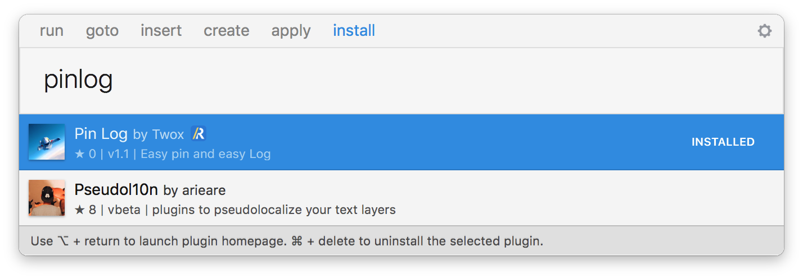
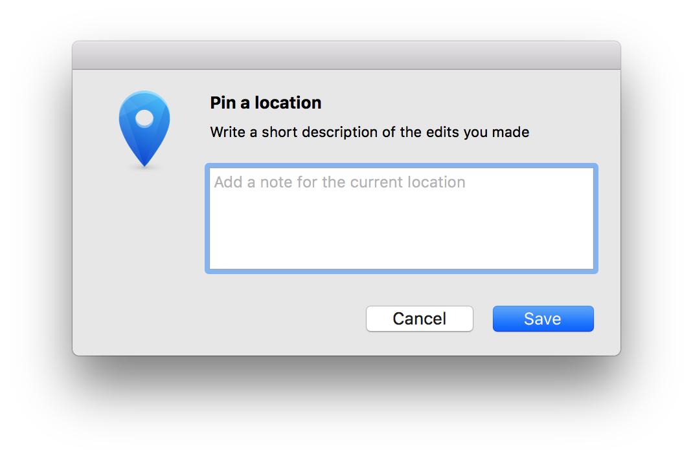
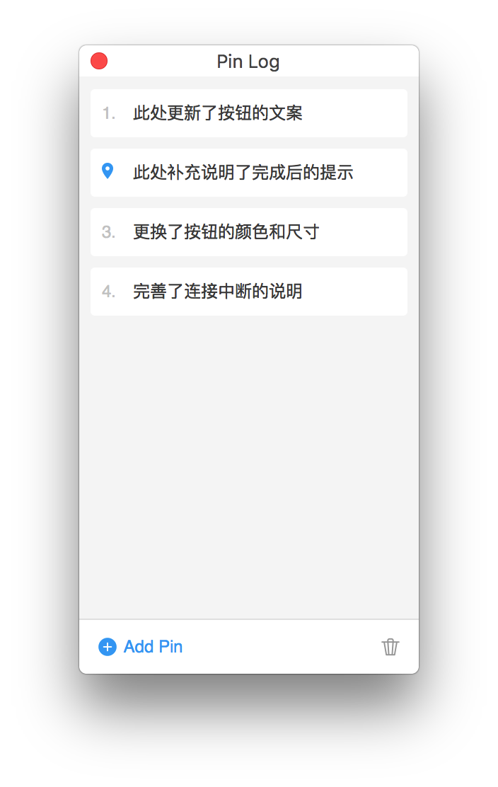

# PinLog

Pin a location and locate the Log.

## Installation

#### Manual Installation

1. [Download](https://github.com/zhongerxin/PinLog/releases/download/v1.1/PinLog.sketchplugin.zip) PinLog.sketchplugin

2. Move the PinLog plugin into your Plugins folder or double-click the .sketchplugin file.

#### Install with Sketch Runner

With Sketch Runner, just go to the `install` command and search for `PinLog`. Runner allows you to manage plugins and do much more to speed up your workflow in Sketch. [Download Runner here](http://www.sketchrunner.com).

## Usage 

#### Add Pin

Use `Shift + Control + P` to pin a location and write a short description of the edits you made.

#### Show Log

Use `Shift + Control + N` to show Logs and click it to locate the original location

